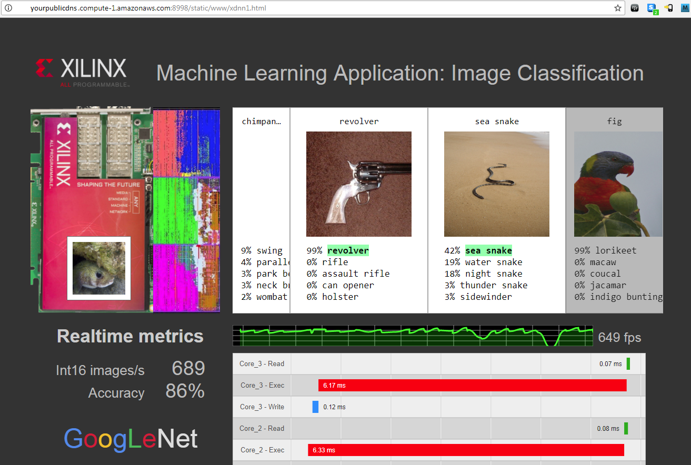

# Image Classification GoogLnet v1 Demo

For launching and connecting to instances, [start here][].

1. Connect to F1
2. Navigate to `/xfdnn_testdrive/`
	```
	$ cd xfdnn_testdrive/
	$ ls
	caffe_ristretto  docker                imagenet      OpenBLAS  start_caffe_docker.sh
	deepdetect       exec_caffe_docker.sh  imagenet_val  README    xilinx

	```
3. Execute `./start_caffe_docker.sh` to enter application docker
	```
	$ ./start_caffe_docker.sh
	/opt/caffe_ristretto$
	```
	In this directory you will see:
    `classify_cat.sh` - Will send four cat images to the FPGA to classify.
    `caffe_test.sh`   - Will run a number of calls to xfDNN using Caffe.
    `run _demo.sh`    - Will run a Image Classification Speed of GoogLeNet v1 demo.
    `kill_demo.sh`    - Will kill the Image Classification .

4. Execute the `./run_demo.sh` script to start the demo
	```
	/opt/caffe_ristretto$ ./run_demo.sh
	Starting demo...
	kill: usage: kill [-s sigspec | -n signum | -sigspec] pid | jobspec ... or kill -l [sigspec]
	Starting producer...
	Starting Web Interface
	```
	Start up of the demo will take a few minutes, but once its complete, the console will start displaying numbers.

5. The demo will display at the following web address:
	`http://yourpublicdns.compute-1.amazonaws.com:8998/static/www/xdnn1.html`

	To get your 'yourpublicdns.compute-1.amazonaws.com' refer to the launching and connecting instructions
	From your browser you will see the running Image Classification Demo:

	


[start here]: launching_instance.md
